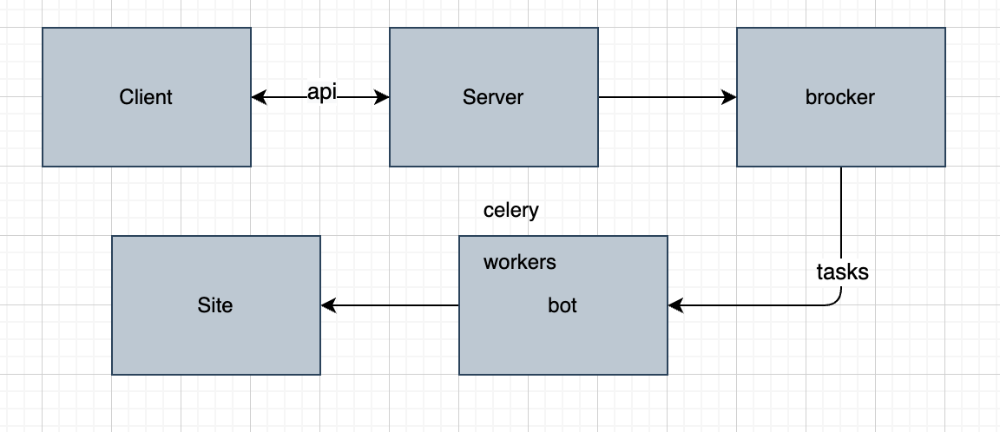
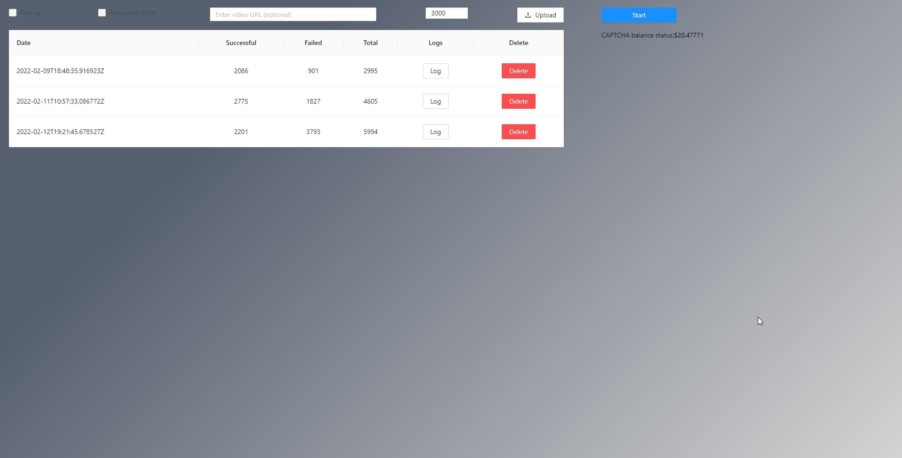
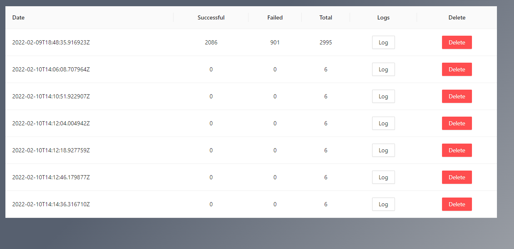
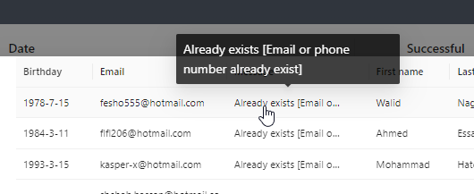

### **General information**
A project for registering accounts on the website - https://mywinstonegypt.com.\
When registering the bot solves the captcha and creates 6000 accounts per hour.\
The .env.example file contains parameters for setting up the project.\
The project uses celery to raise and run 50 bots simultaneously. (can be changed in docker-compose.yml)

### **Used libs** 
* django
* react
* celery
* redis
* postgres

**Project architecture**

**Project UI**\
*Home page*

*Home page with auto run tasks*

*Task log info*\

